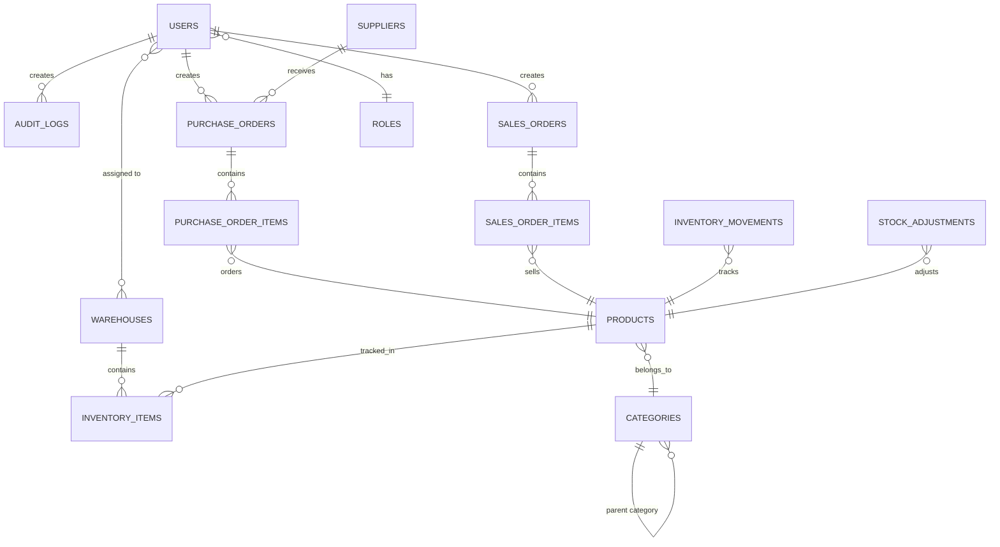

# Database Schema Documentation
# Inventory Management System

**Version:** 1.0.0
**Last Updated:** January 23, 2026
**Database:** PostgreSQL 15+
**ORM:** Spring Data JPA / Hibernate
**Migration Tool:** Flyway

---

## Table of Contents

1. [Overview](#overview)
2. [Entity Relationship Diagram](#entity-relationship-diagram)
3. [Table Definitions](#table-definitions)
4. [Relationships](#relationships)
5. [Indexing Strategy](#indexing-strategy)
6. [Naming Conventions](#naming-conventions)
7. [Data Types & Constraints](#data-types--constraints)
8. [Business Rules](#business-rules)
9. [Status Workflows](#status-workflows)
10. [Sample Queries](#sample-queries)
11. [Migration Strategy](#migration-strategy)
12. [Future Enhancements](#future-enhancements)
13. [Maintenance](#maintenance)
14. [Change Log](#change-log)

---

## Overview

This document describes the complete database schema for the Inventory Management System - a multi-warehouse inventory tracking application with purchase orders, sales orders, supplier management, and comprehensive audit logging.

### Key Features
- Multi-warehouse inventory tracking
- Purchase order management with approval workflow
- Sales order processing and fulfillment
- Stock transfers between warehouses
- Low stock alerts and notifications
- Complete audit trail
- Role-based access control
- Hierarchical product categories

### Technology Stack
- **Database Engine:** PostgreSQL 15.x
- **ORM:** Hibernate 6.x with Spring Data JPA
- **Migration Tool:** Flyway
- **Connection Pool:** HikariCP
- **Isolation Level:** READ_COMMITTED

---

## Entity Relationship Diagram



### Entity Categories

**Core Entities (6 tables):**
- USERS - System users and authentication
- ROLES - Role definitions (ADMIN, MANAGER, WAREHOUSE_STAFF, VIEWER)
- WAREHOUSES - Physical warehouse locations
- CATEGORIES - Hierarchical product categorization
- PRODUCTS - Product catalog
- INVENTORY_ITEMS - Current stock levels per warehouse

**Transaction Entities (8 tables):**
- SUPPLIERS - Vendor information
- PURCHASE_ORDERS - Purchase order headers
- PURCHASE_ORDER_ITEMS - PO line items
- SALES_ORDERS - Sales order headers
- SALES_ORDER_ITEMS - Sales order line items
- INVENTORY_MOVEMENTS - Movement history
- STOCK_ADJUSTMENTS - Manual adjustments

**Support Entities (3 tables):**
- AUDIT_LOGS - Complete audit trail
- NOTIFICATIONS - User notifications
- REPORTS - Generated reports

---

## Table Definitions

### 1. ROLES

**Purpose:** Define system roles for RBAC (Role-Based Access Control)

| Column | Type | Constraints | Description |
|--------|------|-------------|-------------|
| id | BIGINT | PRIMARY KEY, AUTO_INCREMENT | Unique identifier |
| name | VARCHAR(50) | NOT NULL, UNIQUE | Role name (ADMIN, MANAGER, etc.) |
| description | TEXT | - | Role description |
| created_at | TIMESTAMP | NOT NULL, DEFAULT NOW() | Creation timestamp |

**Indexes:**
- PRIMARY KEY on `id`
- UNIQUE INDEX on `name`

**Sample Data:**
```sql
INSERT INTO roles (id, name, description) VALUES
(1, 'ADMIN', 'Full system access'),
(2, 'MANAGER', 'Warehouse and order management'),
(3, 'WAREHOUSE_STAFF', 'Inventory operations only'),
(4, 'VIEWER', 'Read-only access');
```

---

### 2. USERS

**Purpose:** Store user accounts with authentication details

| Column | Type | Constraints | Description |
|--------|------|-------------|-------------|
| id | BIGINT | PRIMARY KEY, AUTO_INCREMENT | Unique identifier |
| username | VARCHAR(50) | NOT NULL, UNIQUE | Login username |
| email | VARCHAR(255) | NOT NULL, UNIQUE | User email address |
| password_hash | VARCHAR(255) | NOT NULL | BCrypt hashed password |
| role_id | BIGINT | NOT NULL, FK → roles(id) | User's role |
| is_active | BOOLEAN | NOT NULL, DEFAULT true | Account status |
| last_login | TIMESTAMP | - | Last login timestamp |
| created_at | TIMESTAMP | NOT NULL, DEFAULT NOW() | Account creation |
| updated_at | TIMESTAMP | NOT NULL, DEFAULT NOW() | Last update |

**Foreign Keys:**
- `role_id` REFERENCES `roles(id)` ON DELETE RESTRICT

**Indexes:**
- PRIMARY KEY on `id`
- UNIQUE INDEX on `username`
- UNIQUE INDEX on `email`
- INDEX on `role_id`
- INDEX on `(is_active, role_id)`
- PARTIAL INDEX on `id` WHERE `is_active = true`

**Sample Data:**
```sql
INSERT INTO users (username, email, password_hash, role_id) VALUES
('admin', 'admin@inventory.com', '$2a$10$...', 1),
('john_manager', 'john@inventory.com', '$2a$10$...', 2);
```

---

### 3. WAREHOUSES

**Purpose:** Define physical warehouse locations

| Column | Type | Constraints | Description |
|--------|------|-------------|-------------|
| id | BIGINT | PRIMARY KEY, AUTO_INCREMENT | Unique identifier |
| name | VARCHAR(100) | NOT NULL, UNIQUE | Warehouse name |
| code | VARCHAR(20) | NOT NULL, UNIQUE | Short warehouse code |
| address | TEXT | NOT NULL | Street address |
| city | VARCHAR(100) | NOT NULL | City |
| state | VARCHAR(100) | - | State/Province |
| country | VARCHAR(100) | NOT NULL | Country |
| postal_code | VARCHAR(20) | - | Postal/ZIP code |
| manager_id | BIGINT | FK → users(id) | Warehouse manager |
| capacity | DECIMAL(12,2) | - | Storage capacity (sq ft) |
| is_active | BOOLEAN | NOT NULL, DEFAULT true | Operational status |
| created_at | TIMESTAMP | NOT NULL, DEFAULT NOW() | Creation timestamp |
| updated_at | TIMESTAMP | NOT NULL, DEFAULT NOW() | Last update |

**Foreign Keys:**
- `manager_id` REFERENCES `users(id)` ON DELETE SET NULL

**Indexes:**
- PRIMARY KEY on `id`
- UNIQUE INDEX on `name`
- UNIQUE INDEX on `code`
- INDEX on `manager_id`
- PARTIAL INDEX on `(id, name)` WHERE `is_active = true`

**Sample Data:**
```sql
INSERT INTO warehouses (name, code, address, city, country, manager_id) VALUES
('Main Warehouse', 'WH001', '123 Storage St', 'New York', 'USA', 2),
('East Coast Distribution', 'WH002', '456 Logistics Ave', 'Boston', 'USA', 2);
```

---

### 4. CATEGORIES

**Purpose:** Hierarchical product categorization

| Column | Type | Constraints | Description |
|--------|------|-------------|-------------|
| id | BIGINT | PRIMARY KEY, AUTO_INCREMENT | Unique identifier |
| name | VARCHAR(100) | NOT NULL, UNIQUE | Category name |
| code | VARCHAR(50) | NOT NULL, UNIQUE | Category code |
| description | TEXT | - | Category description |
| parent_category_id | BIGINT | FK → categories(id) | Parent category (null for root) |
| level | INT | NOT NULL, DEFAULT 0 | Tree depth level |
| created_at | TIMESTAMP | NOT NULL, DEFAULT NOW() | Creation timestamp |
| updated_at | TIMESTAMP | NOT NULL, DEFAULT NOW() | Last update |

**Foreign Keys:**
- `parent_category_id` REFERENCES `categories(id)` ON DELETE CASCADE

**Indexes:**
- PRIMARY KEY on `id`
- UNIQUE INDEX on `name`
- UNIQUE INDEX on `code`
- INDEX on `parent_category_id`
- INDEX on `(level, parent_category_id)`

**Sample Data:**
```sql
INSERT INTO categories (name, code, parent_category_id, level) VALUES
('Electronics', 'ELEC', NULL, 0),
('Computers', 'COMP', 1, 1),
('Laptops', 'LAPT', 2, 2);
```

---

### 5. PRODUCTS

**Purpose:** Product catalog with pricing and stock settings

| Column | Type | Constraints | Description |
|--------|------|-------------|-------------|
| id | BIGINT | PRIMARY KEY, AUTO_INCREMENT | Unique identifier |
| sku | VARCHAR(100) | NOT NULL, UNIQUE | Stock Keeping Unit |
| name | VARCHAR(255) | NOT NULL | Product name |
| description | TEXT | - | Product description |
| category_id | BIGINT | NOT NULL, FK → categories(id) | Product category |
| unit | VARCHAR(20) | NOT NULL | Unit of measure (PIECE, KG, LITER) |
| unit_price | DECIMAL(12,2) | NOT NULL | Selling price |
| cost_price | DECIMAL(12,2) | NOT NULL | Cost/purchase price |
| reorder_level | INT | NOT NULL, DEFAULT 10 | Reorder threshold |
| min_stock_level | INT | NOT NULL, DEFAULT 5 | Minimum stock alert |
| barcode | VARCHAR(50) | UNIQUE | Product barcode |
| image_url | VARCHAR(500) | - | Product image URL |
| is_active | BOOLEAN | NOT NULL, DEFAULT true | Product status |
| created_at | TIMESTAMP | NOT NULL, DEFAULT NOW() | Creation timestamp |
| updated_at | TIMESTAMP | NOT NULL, DEFAULT NOW() | Last update |

**Foreign Keys:**
- `category_id` REFERENCES `categories(id)` ON DELETE RESTRICT

**Indexes:**
- PRIMARY KEY on `id`
- UNIQUE INDEX on `sku`
- UNIQUE INDEX on `barcode` WHERE `barcode IS NOT NULL`
- INDEX on `category_id`
- INDEX on `(is_active, category_id)`
- GIN INDEX on `name` for full-text search
- PARTIAL INDEX on `(id, name, category_id)` WHERE `is_active = true`

**Sample Data:**
```sql
INSERT INTO products (sku, name, category_id, unit, unit_price, cost_price, reorder_level) VALUES
('LAP-001', 'Dell Laptop XPS 15', 3, 'PIECE', 1299.99, 899.00, 5),
('LAP-002', 'MacBook Pro 14"', 3, 'PIECE', 1999.99, 1499.00, 3);
```

---

### 6. INVENTORY_ITEMS

**Purpose:** Track current stock levels per product per warehouse

| Column | Type | Constraints | Description |
|--------|------|-------------|-------------|
| id | BIGINT | PRIMARY KEY, AUTO_INCREMENT | Unique identifier |
| product_id | BIGINT | NOT NULL, FK → products(id) | Product reference |
| warehouse_id | BIGINT | NOT NULL, FK → warehouses(id) | Warehouse reference |
| quantity | INT | NOT NULL, DEFAULT 0, CHECK (quantity >= 0) | Current stock quantity |
| location_code | VARCHAR(50) | - | Rack/shelf location (e.g., A-12-3) |
| last_stock_check | TIMESTAMP | - | Last physical count date |
| created_at | TIMESTAMP | NOT NULL, DEFAULT NOW() | Creation timestamp |
| updated_at | TIMESTAMP | NOT NULL, DEFAULT NOW() | Last update |

**Foreign Keys:**
- `product_id` REFERENCES `products(id)` ON DELETE CASCADE
- `warehouse_id` REFERENCES `warehouses(id)` ON DELETE CASCADE

**Unique Constraints:**
- UNIQUE(`product_id`, `warehouse_id`) - One record per product per warehouse

**Indexes:**
- PRIMARY KEY on `id`
- UNIQUE INDEX on `(product_id, warehouse_id)`
- INDEX on `product_id`
- INDEX on `warehouse_id`
- INDEX on `(warehouse_id, quantity)`

**Sample Data:**
```sql
INSERT INTO inventory_items (product_id, warehouse_id, quantity, location_code) VALUES
(1, 1, 50, 'A-12-3'),
(1, 2, 30, 'B-05-1'),
(2, 1, 15, 'A-13-2');
```

---

### 7. SUPPLIERS

**Purpose:** Vendor/supplier information

| Column | Type | Constraints | Description |
|--------|------|-------------|-------------|
| id | BIGINT | PRIMARY KEY, AUTO_INCREMENT | Unique identifier |
| name | VARCHAR(255) | NOT NULL, UNIQUE | Supplier company name |
| code | VARCHAR(50) | NOT NULL, UNIQUE | Supplier code |
| contact_person | VARCHAR(100) | - | Primary contact name |
| email | VARCHAR(255) | NOT NULL | Contact email |
| phone | VARCHAR(50) | - | Contact phone |
| address | TEXT | - | Business address |
| city | VARCHAR(100) | - | City |
| country | VARCHAR(100) | - | Country |
| payment_terms | VARCHAR(100) | - | Payment terms (Net 30, etc.) |
| rating | INT | CHECK (rating >= 1 AND rating <= 5) | Supplier rating (1-5) |
| is_active | BOOLEAN | NOT NULL, DEFAULT true | Supplier status |
| created_at | TIMESTAMP | NOT NULL, DEFAULT NOW() | Creation timestamp |
| updated_at | TIMESTAMP | NOT NULL, DEFAULT NOW() | Last update |

**Indexes:**
- PRIMARY KEY on `id`
- UNIQUE INDEX on `name`
- UNIQUE INDEX on `code`
- INDEX on `email`
- PARTIAL INDEX on `(id, name)` WHERE `is_active = true`

**Sample Data:**
```sql
INSERT INTO suppliers (name, code, email, payment_terms, rating) VALUES
('Tech Supplies Inc', 'SUP001', 'orders@techsupplies.com', 'Net 30', 5),
('Global Electronics', 'SUP002', 'sales@globalelec.com', 'Net 45', 4);
```

---

### 8. PURCHASE_ORDERS

**Purpose:** Purchase order headers with workflow status

| Column | Type | Constraints | Description |
|--------|------|-------------|-------------|
| id | BIGINT | PRIMARY KEY, AUTO_INCREMENT | Unique identifier |
| po_number | VARCHAR(50) | NOT NULL, UNIQUE | PO number (PO-YYYYMMDD-XXXX) |
| supplier_id | BIGINT | NOT NULL, FK → suppliers(id) | Supplier reference |
| warehouse_id | BIGINT | NOT NULL, FK → warehouses(id) | Destination warehouse |
| created_by | BIGINT | NOT NULL, FK → users(id) | Order creator |
| status | VARCHAR(20) | NOT NULL, DEFAULT 'DRAFT' | Order status |
| order_date | DATE | NOT NULL | Order placement date |
| expected_delivery_date | DATE | - | Expected delivery |
| actual_delivery_date | DATE | - | Actual delivery |
| subtotal | DECIMAL(12,2) | NOT NULL, DEFAULT 0 | Subtotal amount |
| tax_amount | DECIMAL(12,2) | NOT NULL, DEFAULT 0 | Tax amount |
| discount_amount | DECIMAL(12,2) | NOT NULL, DEFAULT 0 | Discount amount |
| total_amount | DECIMAL(12,2) | NOT NULL, DEFAULT 0 | Total amount |
| notes | TEXT | - | Order notes |
| created_at | TIMESTAMP | NOT NULL, DEFAULT NOW() | Creation timestamp |
| updated_at | TIMESTAMP | NOT NULL, DEFAULT NOW() | Last update |

**Foreign Keys:**
- `supplier_id` REFERENCES `suppliers(id)` ON DELETE RESTRICT
- `warehouse_id` REFERENCES `warehouses(id)` ON DELETE RESTRICT
- `created_by` REFERENCES `users(id)` ON DELETE RESTRICT

**Check Constraints:**
- `status` IN ('DRAFT', 'SUBMITTED', 'APPROVED', 'RECEIVED', 'CANCELLED')

**Indexes:**
- PRIMARY KEY on `id`
- UNIQUE INDEX on `po_number`
- INDEX on `supplier_id`
- INDEX on `warehouse_id`
- INDEX on `created_by`
- INDEX on `status`
- INDEX on `(status, order_date DESC)`
- INDEX on `(supplier_id, order_date DESC)`
- INDEX on `order_date DESC`

**Sample Data:**
```sql
INSERT INTO purchase_orders (po_number, supplier_id, warehouse_id, created_by, status, order_date, total_amount) VALUES
('PO-20260123-0001', 1, 1, 2, 'APPROVED', '2026-01-23', 12999.90);
```

---

### 9. PURCHASE_ORDER_ITEMS

**Purpose:** Line items for purchase orders

| Column | Type | Constraints | Description |
|--------|------|-------------|-------------|
| id | BIGINT | PRIMARY KEY, AUTO_INCREMENT | Unique identifier |
| purchase_order_id | BIGINT | NOT NULL, FK → purchase_orders(id) | PO reference |
| product_id | BIGINT | NOT NULL, FK → products(id) | Product reference |
| quantity_ordered | INT | NOT NULL, CHECK (quantity_ordered > 0) | Ordered quantity |
| quantity_received | INT | NOT NULL, DEFAULT 0, CHECK (quantity_received >= 0) | Received quantity |
| unit_price | DECIMAL(12,2) | NOT NULL | Price per unit |
| line_total | DECIMAL(12,2) | NOT NULL | Line total (qty * price) |
| created_at | TIMESTAMP | NOT NULL, DEFAULT NOW() | Creation timestamp |
| updated_at | TIMESTAMP | NOT NULL, DEFAULT NOW() | Last update |

**Foreign Keys:**
- `purchase_order_id` REFERENCES `purchase_orders(id)` ON DELETE CASCADE
- `product_id` REFERENCES `products(id)` ON DELETE RESTRICT

**Indexes:**
- PRIMARY KEY on `id`
- INDEX on `purchase_order_id`
- INDEX on `product_id`
- INDEX on `(purchase_order_id, product_id)`

**Sample Data:**
```sql
INSERT INTO purchase_order_items (purchase_order_id, product_id, quantity_ordered, unit_price, line_total) VALUES
(1, 1, 10, 899.00, 8990.00),
(1, 2, 2, 1499.00, 2998.00);
```

---

### 10. SALES_ORDERS

**Purpose:** Sales order headers with customer and shipping information

| Column | Type | Constraints | Description |
|--------|------|-------------|-------------|
| id | BIGINT | PRIMARY KEY, AUTO_INCREMENT | Unique identifier |
| so_number | VARCHAR(50) | NOT NULL, UNIQUE | SO number (SO-YYYYMMDD-XXXX) |
| customer_name | VARCHAR(255) | NOT NULL | Customer name |
| customer_email | VARCHAR(255) | NOT NULL | Customer email |
| customer_phone | VARCHAR(50) | - | Customer phone |
| shipping_address | TEXT | NOT NULL | Shipping address |
| city | VARCHAR(100) | NOT NULL | Shipping city |
| postal_code | VARCHAR(20) | NOT NULL | Shipping postal code |
| warehouse_id | BIGINT | NOT NULL, FK → warehouses(id) | Fulfillment warehouse |
| created_by | BIGINT | NOT NULL, FK → users(id) | Order creator |
| status | VARCHAR(20) | NOT NULL, DEFAULT 'PENDING' | Order status |
| order_date | DATE | NOT NULL | Order date |
| fulfillment_date | DATE | - | Fulfillment date |
| shipping_date | DATE | - | Shipping date |
| delivery_date | DATE | - | Delivery date |
| subtotal | DECIMAL(12,2) | NOT NULL, DEFAULT 0 | Subtotal amount |
| tax_amount | DECIMAL(12,2) | NOT NULL, DEFAULT 0 | Tax amount |
| shipping_cost | DECIMAL(12,2) | NOT NULL, DEFAULT 0 | Shipping cost |
| total_amount | DECIMAL(12,2) | NOT NULL, DEFAULT 0 | Total amount |
| notes | TEXT | - | Order notes |
| created_at | TIMESTAMP | NOT NULL, DEFAULT NOW() | Creation timestamp |
| updated_at | TIMESTAMP | NOT NULL, DEFAULT NOW() | Last update |

**Foreign Keys:**
- `warehouse_id` REFERENCES `warehouses(id)` ON DELETE RESTRICT
- `created_by` REFERENCES `users(id)` ON DELETE RESTRICT

**Check Constraints:**
- `status` IN ('PENDING', 'CONFIRMED', 'FULFILLED', 'SHIPPED', 'DELIVERED', 'CANCELLED')

**Indexes:**
- PRIMARY KEY on `id`
- UNIQUE INDEX on `so_number`
- INDEX on `warehouse_id`
- INDEX on `created_by`
- INDEX on `status`
- INDEX on `(status, order_date DESC)`
- GIN INDEX on `customer_name` for full-text search
- INDEX on `customer_email`
- INDEX on `order_date DESC`
- INDEX on `fulfillment_date DESC`

**Sample Data:**
```sql
INSERT INTO sales_orders (so_number, customer_name, customer_email, shipping_address, city, postal_code, warehouse_id, created_by, status, order_date, total_amount) VALUES
('SO-20260123-0001', 'John Doe', 'john@email.com', '789 Customer St', 'New York', '10001', 1, 2, 'CONFIRMED', '2026-01-23', 1399.99);
```

---

### 11. SALES_ORDER_ITEMS

**Purpose:** Line items for sales orders

| Column | Type | Constraints | Description |
|--------|------|-------------|-------------|
| id | BIGINT | PRIMARY KEY, AUTO_INCREMENT | Unique identifier |
| sales_order_id | BIGINT | NOT NULL, FK → sales_orders(id) | SO reference |
| product_id | BIGINT | NOT NULL, FK → products(id) | Product reference |
| quantity | INT | NOT NULL, CHECK (quantity > 0) | Ordered quantity |
| unit_price | DECIMAL(12,2) | NOT NULL | Price per unit |
| line_total | DECIMAL(12,2) | NOT NULL | Line total (qty * price) |
| created_at | TIMESTAMP | NOT NULL, DEFAULT NOW() | Creation timestamp |
| updated_at | TIMESTAMP | NOT NULL, DEFAULT NOW() | Last update |

**Foreign Keys:**
- `sales_order_id` REFERENCES `sales_orders(id)` ON DELETE CASCADE
- `product_id` REFERENCES `products(id)` ON DELETE RESTRICT

**Indexes:**
- PRIMARY KEY on `id`
- INDEX on `sales_order_id`
- INDEX on `product_id`
- INDEX on `(sales_order_id, product_id)`

**Sample Data:**
```sql
INSERT INTO sales_order_items (sales_order_id, product_id, quantity, unit_price, line_total) VALUES
(1, 1, 1, 1299.99, 1299.99);
```

---

### 12. INVENTORY_MOVEMENTS

**Purpose:** Track all inventory movements (transfers, receipts, shipments)

| Column | Type | Constraints | Description |
|--------|------|-------------|-------------|
| id | BIGINT | PRIMARY KEY, AUTO_INCREMENT | Unique identifier |
| product_id | BIGINT | NOT NULL, FK → products(id) | Product reference |
| from_warehouse_id | BIGINT | FK → warehouses(id) | Source warehouse (null for receipts) |
| to_warehouse_id | BIGINT | FK → warehouses(id) | Destination warehouse (null for shipments) |
| quantity | INT | NOT NULL, CHECK (quantity > 0) | Movement quantity |
| movement_type | VARCHAR(20) | NOT NULL | Movement type |
| reason | TEXT | - | Movement reason |
| reference_number | VARCHAR(50) | - | Related PO/SO number |
| performed_by | BIGINT | NOT NULL, FK → users(id) | User who performed movement |
| movement_date | TIMESTAMP | NOT NULL | Movement timestamp |
| created_at | TIMESTAMP | NOT NULL, DEFAULT NOW() | Record creation |

**Foreign Keys:**
- `product_id` REFERENCES `products(id)` ON DELETE RESTRICT
- `from_warehouse_id` REFERENCES `warehouses(id)` ON DELETE RESTRICT
- `to_warehouse_id` REFERENCES `warehouses(id)` ON DELETE RESTRICT
- `performed_by` REFERENCES `users(id)` ON DELETE RESTRICT

**Check Constraints:**
- `movement_type` IN ('TRANSFER', 'ADJUSTMENT', 'RECEIPT', 'SHIPMENT')
- At least one of `from_warehouse_id` or `to_warehouse_id` must be NOT NULL

**Indexes:**
- PRIMARY KEY on `id`
- INDEX on `product_id`
- INDEX on `from_warehouse_id`
- INDEX on `to_warehouse_id`
- INDEX on `performed_by`
- INDEX on `movement_type`
- INDEX on `(product_id, movement_date DESC)`
- INDEX on `(from_warehouse_id, to_warehouse_id, movement_date DESC)`
- INDEX on `movement_date DESC`
- INDEX on `reference_number` WHERE `reference_number IS NOT NULL`

**Sample Data:**
```sql
INSERT INTO inventory_movements (product_id, from_warehouse_id, to_warehouse_id, quantity, movement_type, reference_number, performed_by, movement_date) VALUES
(1, NULL, 1, 50, 'RECEIPT', 'PO-20260123-0001', 2, NOW()),
(1, 1, 2, 10, 'TRANSFER', NULL, 2, NOW());
```

---

### 13. STOCK_ADJUSTMENTS

**Purpose:** Manual stock adjustments with approval workflow

| Column | Type | Constraints | Description |
|--------|------|-------------|-------------|
| id | BIGINT | PRIMARY KEY, AUTO_INCREMENT | Unique identifier |
| product_id | BIGINT | NOT NULL, FK → products(id) | Product reference |
| warehouse_id | BIGINT | NOT NULL, FK → warehouses(id) | Warehouse reference |
| quantity_before | INT | NOT NULL | Quantity before adjustment |
| quantity_after | INT | NOT NULL | Quantity after adjustment |
| quantity_change | INT | NOT NULL | Change amount (+/-) |
| adjustment_type | VARCHAR(20) | NOT NULL | Adjustment type |
| reason | VARCHAR(100) | NOT NULL | Adjustment reason |
| performed_by | BIGINT | NOT NULL, FK → users(id) | User who created adjustment |
| approved_by | BIGINT | FK → users(id) | User who approved |
| status | VARCHAR(20) | NOT NULL, DEFAULT 'PENDING' | Approval status |
| notes | TEXT | - | Additional notes |
| adjustment_date | TIMESTAMP | NOT NULL | Adjustment timestamp |
| created_at | TIMESTAMP | NOT NULL, DEFAULT NOW() | Record creation |
| updated_at | TIMESTAMP | NOT NULL, DEFAULT NOW() | Last update |

**Foreign Keys:**
- `product_id` REFERENCES `products(id)` ON DELETE RESTRICT
- `warehouse_id` REFERENCES `warehouses(id)` ON DELETE RESTRICT
- `performed_by` REFERENCES `users(id)` ON DELETE RESTRICT
- `approved_by` REFERENCES `users(id)` ON DELETE RESTRICT

**Check Constraints:**
- `adjustment_type` IN ('ADD', 'REMOVE', 'CORRECTION')
- `status` IN ('PENDING', 'APPROVED', 'REJECTED')
- `reason` IN ('DAMAGED', 'EXPIRED', 'THEFT', 'COUNT_ERROR', 'RETURN', 'OTHER')

**Indexes:**
- PRIMARY KEY on `id`
- INDEX on `product_id`
- INDEX on `warehouse_id`
- INDEX on `performed_by`
- INDEX on `approved_by`
- INDEX on `status`
- PARTIAL INDEX on `(status, adjustment_date DESC)` WHERE `status = 'PENDING'`
- INDEX on `adjustment_date DESC`

**Sample Data:**
```sql
INSERT INTO stock_adjustments (product_id, warehouse_id, quantity_before, quantity_after, quantity_change, adjustment_type, reason, performed_by, status, adjustment_date) VALUES
(1, 1, 50, 48, -2, 'REMOVE', 'DAMAGED', 2, 'PENDING', NOW());
```

---

### 14. AUDIT_LOGS

**Purpose:** Complete audit trail for all critical operations

| Column | Type | Constraints | Description |
|--------|------|-------------|-------------|
| id | BIGINT | PRIMARY KEY, AUTO_INCREMENT | Unique identifier |
| entity_type | VARCHAR(50) | NOT NULL | Entity type (USER, PRODUCT, ORDER, etc.) |
| entity_id | BIGINT | NOT NULL | Entity ID |
| action | VARCHAR(20) | NOT NULL | Action performed |
| old_values | JSONB | - | Previous values (JSON) |
| new_values | JSONB | - | New values (JSON) |
| performed_by | BIGINT | NOT NULL, FK → users(id) | User who performed action |
| ip_address | VARCHAR(45) | - | User IP address |
| user_agent | TEXT | - | Browser user agent |
| created_at | TIMESTAMP | NOT NULL, DEFAULT NOW() | Action timestamp |

**Foreign Keys:**
- `performed_by` REFERENCES `users(id)` ON DELETE RESTRICT

**Check Constraints:**
- `action` IN ('CREATE', 'UPDATE', 'DELETE', 'LOGIN', 'LOGOUT', 'APPROVE', 'REJECT')

**Indexes:**
- PRIMARY KEY on `id`
- INDEX on `performed_by`
- INDEX on `(entity_type, entity_id)`
- INDEX on `action`
- INDEX on `(entity_type, entity_id, created_at DESC)`
- INDEX on `created_at DESC`
- INDEX on `(performed_by, created_at DESC)`

**Sample Data:**
```sql
INSERT INTO audit_logs (entity_type, entity_id, action, new_values, performed_by, ip_address) VALUES
('PRODUCT', 1, 'CREATE', '{"sku":"LAP-001","name":"Dell Laptop XPS 15"}', 1, '192.168.1.1');
```

---

### 15. NOTIFICATIONS

**Purpose:** User notifications and alerts

| Column | Type | Constraints | Description |
|--------|------|-------------|-------------|
| id | BIGINT | PRIMARY KEY, AUTO_INCREMENT | Unique identifier |
| user_id | BIGINT | NOT NULL, FK → users(id) | Recipient user |
| notification_type | VARCHAR(50) | NOT NULL | Notification type |
| title | VARCHAR(255) | NOT NULL | Notification title |
| message | TEXT | NOT NULL | Notification message |
| priority | VARCHAR(20) | NOT NULL, DEFAULT 'MEDIUM' | Priority level |
| is_read | BOOLEAN | NOT NULL, DEFAULT false | Read status |
| reference_type | VARCHAR(50) | - | Related entity type |
| reference_id | BIGINT | - | Related entity ID |
| created_at | TIMESTAMP | NOT NULL, DEFAULT NOW() | Creation timestamp |
| read_at | TIMESTAMP | - | Read timestamp |

**Foreign Keys:**
- `user_id` REFERENCES `users(id)` ON DELETE CASCADE

**Check Constraints:**
- `notification_type` IN ('LOW_STOCK', 'ORDER_APPROVED', 'ORDER_RECEIVED', 'SHIPMENT', 'STOCK_ADJUSTMENT', 'SYSTEM')
- `priority` IN ('LOW', 'MEDIUM', 'HIGH', 'CRITICAL')

**Indexes:**
- PRIMARY KEY on `id`
- INDEX on `user_id`
- PARTIAL INDEX on `(user_id, created_at DESC)` WHERE `is_read = false`
- INDEX on `notification_type`
- INDEX on `(user_id, created_at DESC)`

**Sample Data:**
```sql
INSERT INTO notifications (user_id, notification_type, title, message, priority) VALUES
(2, 'LOW_STOCK', 'Low Stock Alert', 'Product LAP-001 is below reorder level', 'HIGH');
```

---

### 16. REPORTS

**Purpose:** Track generated reports and analytics

| Column | Type | Constraints | Description |
|--------|------|-------------|-------------|
| id | BIGINT | PRIMARY KEY, AUTO_INCREMENT | Unique identifier |
| report_type | VARCHAR(50) | NOT NULL | Report type |
| name | VARCHAR(255) | NOT NULL | Report name |
| description | TEXT | - | Report description |
| generated_by | BIGINT | NOT NULL, FK → users(id) | User who generated report |
| parameters | JSONB | - | Report parameters (JSON) |
| file_url | VARCHAR(500) | - | S3 URL to report file |
| status | VARCHAR(20) | NOT NULL, DEFAULT 'PENDING' | Generation status |
| generated_at | TIMESTAMP | - | Generation completion time |
| created_at | TIMESTAMP | NOT NULL, DEFAULT NOW() | Request timestamp |

**Foreign Keys:**
- `generated_by` REFERENCES `users(id)` ON DELETE RESTRICT

**Check Constraints:**
- `report_type` IN ('STOCK_VALUATION', 'MOVEMENT_HISTORY', 'SALES_ANALYSIS', 'LOW_STOCK', 'PURCHASE_HISTORY')
- `status` IN ('PENDING', 'COMPLETED', 'FAILED')

**Indexes:**
- PRIMARY KEY on `id`
- INDEX on `generated_by`
- INDEX on `report_type`
- INDEX on `status`
- INDEX on `(generated_by, generated_at DESC)`

**Sample Data:**
```sql
INSERT INTO reports (report_type, name, generated_by, status) VALUES
('STOCK_VALUATION', 'Monthly Stock Valuation - Jan 2026', 1, 'COMPLETED');
```

---

## Relationships

### One-to-Many Relationships

#### ROLES → USERS (1:N)
- One role can be assigned to many users
- Each user has exactly one role
- CASCADE: If role is deleted, restrict deletion (data integrity)

#### WAREHOUSES → INVENTORY_ITEMS (1:N)
- One warehouse contains many inventory items
- Each inventory item belongs to one warehouse
- CASCADE: If warehouse is deleted, cascade delete inventory items

#### PRODUCTS → INVENTORY_ITEMS (1:N)
- One product can be stored in multiple warehouses
- Each inventory item tracks one product
- CASCADE: Delete inventory when product is deleted

#### CATEGORIES → PRODUCTS (1:N)
- One category contains many products
- Each product belongs to one category
- RESTRICT: Cannot delete category with products

#### SUPPLIERS → PURCHASE_ORDERS (1:N)
- One supplier can have many purchase orders
- Each PO is from one supplier
- RESTRICT: Cannot delete supplier with orders

#### PURCHASE_ORDERS → PURCHASE_ORDER_ITEMS (1:N)
- One PO contains many line items
- Each line item belongs to one PO
- CASCADE: Delete items when PO is deleted

#### SALES_ORDERS → SALES_ORDER_ITEMS (1:N)
- One SO contains many line items
- Each line item belongs to one SO
- CASCADE: Delete items when SO is deleted

#### USERS → AUDIT_LOGS (1:N)
- One user can create many audit log entries
- Each audit log is created by one user
- RESTRICT: Cannot delete user with audit history

#### USERS → NOTIFICATIONS (1:N)
- One user can receive many notifications
- Each notification belongs to one user
- CASCADE: Delete notifications when user is deleted

### Many-to-Many Relationships

#### USERS ↔ WAREHOUSES (M:N)
- Users can be assigned to multiple warehouses
- Warehouses can have multiple staff members
- Implementation: Through user-warehouse assignment table (future)

### Self-Referencing Relationships

#### CATEGORIES → CATEGORIES (Hierarchical)
- Categories can have parent categories
- Enables multi-level categorization (Electronics → Computers → Laptops)
- CASCADE: Delete child categories when parent is deleted
- NULL parent indicates root category

### Composite Relationships

#### INVENTORY_ITEMS (Product + Warehouse)
- Unique constraint on (product_id, warehouse_id)
- One product can only have one record per warehouse
- Ensures no duplicate inventory records

---

## Indexing Strategy

### Primary Index Types Used

#### 1. B-tree Indexes (Default)
- Used for: Equality searches, range queries, ORDER BY
- Applied to: All PKs, FKs, date columns, status columns

#### 2. Unique Indexes
- Enforce uniqueness and improve lookup performance
- Applied to: SKU, barcode, email, username, codes

#### 3. Composite Indexes
- Multi-column indexes for queries with multiple filters
- Examples:
  - `(status, order_date)` - Dashboard queries filtering by status and ordering by date
  - `(product_id, warehouse_id)` - Inventory lookups
  - `(entity_type, entity_id, created_at)` - Audit trail queries

#### 4. Partial Indexes
- Index only subset of rows (reduces size, faster updates)
- Examples:
  - `WHERE is_active = true` - Only index active records
  - `WHERE status = 'PENDING'` - Only index pending items
  - `WHERE is_read = false` - Only index unread notifications

#### 5. GIN Indexes (PostgreSQL)
- Full-text search capability
- Applied to: product names, customer names, descriptions
- Enables fuzzy matching with trigram similarity

### Index Naming Convention

```
idx_{table}_{columns}                    # Regular index
idx_{table}_{columns}_{condition}        # Partial index
uk_{table}_{column}                      # Unique constraint (rarely used, prefer UNIQUE INDEX)
```

### Index Maintenance Guidelines

**When to REINDEX:**
- Monthly for heavily updated tables
- After bulk data modifications
- When query performance degrades

**Monitoring Queries:**
```sql
-- Find unused indexes
SELECT schemaname, tablename, indexname, idx_scan
FROM pg_stat_user_indexes
WHERE idx_scan = 0
AND indexname NOT LIKE '%_pkey'
ORDER BY pg_relation_size(indexrelid) DESC;

-- Find missing indexes (tables with sequential scans)
SELECT schemaname, tablename, seq_scan, seq_tup_read,
       idx_scan, idx_tup_fetch,
       seq_tup_read / seq_scan as avg_seq_tup
FROM pg_stat_user_tables
WHERE seq_scan > 0
ORDER BY seq_tup_read DESC;

-- Index size analysis
SELECT schemaname, tablename, indexname,
       pg_size_pretty(pg_relation_size(indexrelid)) as index_size
FROM pg_stat_user_indexes
ORDER BY pg_relation_size(indexrelid) DESC;
```

---

## Naming Conventions

### Table Names
- **Format:** `snake_case`, plural form
- **Examples:** `users`, `purchase_orders`, `inventory_items`
- **Rationale:** Matches PostgreSQL convention, readable

### Column Names
- **Format:** `snake_case`
- **Examples:** `created_at`, `customer_email`, `quantity_ordered`
- **Avoid:** Abbreviations (except common ones like `id`)

### Primary Keys
- **Always:** `id` (BIGINT AUTO_INCREMENT)
- **Never:** Composite primary keys (use surrogate keys)

### Foreign Keys
- **Format:** `{referenced_table_singular}_id`
- **Examples:** `user_id`, `warehouse_id`, `product_id`
- **Special cases:**
  - `from_warehouse_id` / `to_warehouse_id` (multiple FKs to same table)
  - `created_by` / `approved_by` (role-based FKs to users)

### Indexes
- **Regular:** `idx_{table}_{column1}_{column2}`
- **Unique:** Use `UNIQUE INDEX` instead of separate constraint
- **Partial:** `idx_{table}_{columns}_{condition}`
- **Examples:**
  - `idx_products_sku`
  - `idx_inventory_product_warehouse`
  - `idx_users_active_only`

### Constraints
- **Check:** `chk_{table}_{description}`
- **Unique:** Handled by unique indexes
- **Examples:** `chk_stock_quantity_positive`

### Boolean Columns
- **Prefix:** `is_` or `has_`
- **Examples:** `is_active`, `is_read`, `has_shipped`
- **Default:** Always specify (usually `true` or `false`)

### Timestamp Columns
- **Standard names:**
  - `created_at` - Record creation
  - `updated_at` - Last modification
  - `deleted_at` - Soft delete timestamp (if using soft deletes)
  - `{action}_date` - Business dates (order_date, delivery_date)

### Enum Values
- **Format:** UPPERCASE_SNAKE_CASE
- **Examples:** `PENDING`, `IN_PROGRESS`, `COMPLETED`
- **Storage:** VARCHAR with CHECK constraint (more flexible than PostgreSQL ENUMs)

---

## Data Types & Constraints

### Standard Data Types

| Use Case | Data Type | Example | Rationale |
|----------|-----------|---------|-----------|
| Primary Keys | BIGINT | `id BIGINT` | Supports 9 quintillion records |
| Foreign Keys | BIGINT | `user_id BIGINT` | Match PK type |
| Short Text | VARCHAR(n) | `VARCHAR(100)` | Variable length, efficient |
| Long Text | TEXT | `description TEXT` | Unlimited length |
| Money | DECIMAL(12,2) | `DECIMAL(12,2)` | Exact precision, no rounding |
| Integers | INT | `quantity INT` | -2B to +2B range |
| Booleans | BOOLEAN | `is_active BOOLEAN` | True/false values |
| Dates | DATE | `order_date DATE` | Date only (no time) |
| Timestamps | TIMESTAMP | `created_at TIMESTAMP` | Date + time |
| JSON Data | JSONB | `parameters JSONB` | Binary JSON, indexable |
| Enums | VARCHAR(20) + CHECK | `status VARCHAR(20)` | Flexible, changeable |

### Constraint Best Practices

#### NOT NULL
- Apply to all columns except:
  - Optional foreign keys (e.g., `approved_by`)
  - Optional business fields (e.g., `barcode`)
- **Always** apply to: `created_at`, `updated_at`, PKs, FKs (when required)

#### DEFAULT Values
```sql
-- Timestamps
created_at TIMESTAMP NOT NULL DEFAULT NOW()
updated_at TIMESTAMP NOT NULL DEFAULT NOW()

-- Booleans
is_active BOOLEAN NOT NULL DEFAULT true
is_read BOOLEAN NOT NULL DEFAULT false

-- Numeric
quantity INT NOT NULL DEFAULT 0
total_amount DECIMAL(12,2) NOT NULL DEFAULT 0

-- Status
status VARCHAR(20) NOT NULL DEFAULT 'DRAFT'
```

#### CHECK Constraints
```sql
-- Positive quantities
quantity INT CHECK (quantity >= 0)

-- Rating range
rating INT CHECK (rating >= 1 AND rating <= 5)

-- Status values
status VARCHAR(20) CHECK (status IN ('PENDING', 'APPROVED', 'REJECTED'))

-- Conditional logic
CHECK (from_warehouse_id IS NOT NULL OR to_warehouse_id IS NOT NULL)
```

#### UNIQUE Constraints
- Prefer unique indexes over constraints (more control)
- Use partial unique indexes when needed:
```sql
CREATE UNIQUE INDEX idx_products_barcode
ON products(barcode) WHERE barcode IS NOT NULL;
```

---

## Business Rules

### Inventory Management Rules

1. **Inventory Quantity Rules**
   - Inventory quantity cannot be negative
   - Stock deductions must check available quantity first
   - Implement optimistic locking to prevent overselling
   - Use database transactions for all inventory operations

2. **Reorder Level Logic**
   - Alert when `quantity <= reorder_level`
   - Different thresholds per warehouse possible
   - Generate notifications for warehouse managers
   - Consider lead time in reorder calculations

3. **Stock Transfer Rules**
   - Source warehouse must have sufficient stock
   - Both warehouses must be active
   - Movement is atomic (decrement source, increment destination)
   - Create movement record for audit trail

### Order Management Rules

4. **Purchase Order Workflow**
   - Draft orders can be edited freely
   - Submitted orders require manager approval
   - Approved orders generate receiving tasks
   - Receiving updates inventory automatically
   - Partial receipts allowed (track `quantity_received` vs `quantity_ordered`)

5. **Sales Order Rules**
   - Check inventory availability before confirming order
   - Reserve inventory on order confirmation
   - Fulfill from assigned warehouse only
   - Cannot ship more than ordered quantity
   - Generate invoice on shipment

6. **Order Number Generation**
   - Format: `{PREFIX}-YYYYMMDD-{SEQUENCE}`
   - Examples: `PO-20260123-0001`, `SO-20260123-0042`
   - Sequence resets daily
   - Must be unique across all time

### Authorization Rules

7. **Role-Based Access Control**
   - **ADMIN**: Full system access
   - **MANAGER**: Create/approve orders, manage inventory
   - **WAREHOUSE_STAFF**: View inventory, process shipments, receive orders
   - **VIEWER**: Read-only access to reports

8. **Warehouse Assignment**
   - Users can be assigned to multiple warehouses
   - Staff can only operate on assigned warehouses
   - Managers can view all warehouses
   - System validates warehouse access on operations

### Data Integrity Rules

9. **Audit Trail Requirements**
   - All CREATE, UPDATE, DELETE operations logged
   - Store before/after values in JSON
   - Include user, IP, timestamp, user agent
   - Cannot delete audit logs (compliance)

10. **Soft Delete Policy**
    - Never hard delete: users, products, orders, suppliers
    - Use `is_active = false` for soft deletes
    - Maintain data integrity for historical reports
    - Clean up after regulatory retention period

11. **Referential Integrity**
    - Cannot delete products with inventory
    - Cannot delete warehouses with inventory
    - Cannot delete suppliers with orders
    - Cannot delete users with created records

### Validation Rules

12. **Product Validation**
    - SKU must be unique
    - Barcode must be unique (if provided)
    - Unit price must be positive
    - Reorder level must be >= min stock level

13. **Order Validation**
    - Order must have at least one line item
    - Line item quantity must be positive
    - Unit prices must match product prices (or have approval for discount)
    - Total amount = sum of line totals + tax - discount

14. **Email and Phone Format**
    - Email must match regex pattern
    - Phone numbers stored in E.164 format (+country code)
    - Validate on application layer

---

## Status Workflows

### Purchase Order Workflow

```
DRAFT
  ↓ (Submit)
SUBMITTED
  ↓ (Approve - Manager only)
APPROVED
  ↓ (Receive Shipment)
RECEIVED

  Any status → CANCELLED (with reason)
```

**Transitions:**
- `DRAFT → SUBMITTED`: Validate all line items, calculate totals
- `SUBMITTED → APPROVED`: Requires MANAGER or ADMIN role
- `APPROVED → RECEIVED`: Update inventory quantities, create movement records
- `Any → CANCELLED`: Record cancellation reason, release any allocations

**Status-Based Permissions:**
- DRAFT: Can edit, can delete
- SUBMITTED: Cannot edit, can cancel
- APPROVED: Cannot edit, can cancel with approval
- RECEIVED: Cannot edit or delete (historical record)
- CANCELLED: Read-only

---

### Sales Order Workflow

```
PENDING
  ↓ (Confirm & Reserve Stock)
CONFIRMED
  ↓ (Pick & Pack)
FULFILLED
  ↓ (Ship)
SHIPPED
  ↓ (Deliver)
DELIVERED

  Any status → CANCELLED (before SHIPPED)
```

**Transitions:**
- `PENDING → CONFIRMED`: Check inventory, reserve stock
- `CONFIRMED → FULFILLED`: Deduct inventory, create movement record
- `FULFILLED → SHIPPED`: Generate shipping label, update tracking
- `SHIPPED → DELIVERED`: Update delivery confirmation
- `Any → CANCELLED` (before SHIPPED): Release reserved inventory

**Auto-transitions:**
- Pending → Auto-cancel after 7 days of inactivity
- Shipped → Delivered after tracking confirmation (integration)

---

### Stock Adjustment Workflow

```
PENDING
  ↓ (Approve - Manager)
APPROVED → (Apply to Inventory)

  ↓ (Reject - Manager)
REJECTED
```

**Transitions:**
- `PENDING → APPROVED`: Requires MANAGER approval, apply adjustment to inventory
- `PENDING → REJECTED`: Record rejection reason, no inventory change

**Rules:**
- Adjustments > 10% of stock value require ADMIN approval
- All adjustments create audit log entry
- Approved adjustments create movement records

---

## Sample Queries

### 1. Get Low Stock Products (Dashboard)
```sql
SELECT
    p.id, p.sku, p.name, c.name as category,
    w.name as warehouse,
    i.quantity as current_stock,
    p.reorder_level,
    (p.reorder_level - i.quantity) as shortage
FROM products p
JOIN categories c ON p.category_id = c.id
JOIN inventory_items i ON p.id = i.product_id
JOIN warehouses w ON i.warehouse_id = w.id
WHERE p.is_active = true
  AND i.quantity <= p.reorder_level
ORDER BY shortage DESC;
```

### 2. Pending Purchase Orders (Approval Queue)
```sql
SELECT
    po.po_number,
    po.order_date,
    s.name as supplier,
    w.name as warehouse,
    u.username as created_by,
    po.total_amount,
    COUNT(poi.id) as item_count
FROM purchase_orders po
JOIN suppliers s ON po.supplier_id = s.id
JOIN warehouses w ON po.warehouse_id = w.id
JOIN users u ON po.created_by = u.id
LEFT JOIN purchase_order_items poi ON po.id = poi.purchase_order_id
WHERE po.status = 'SUBMITTED'
GROUP BY po.id, s.name, w.name, u.username
ORDER BY po.order_date ASC;
```

### 3. Product Movement History
```sql
SELECT
    im.movement_date,
    p.sku,
    p.name as product,
    wf.name as from_warehouse,
    wt.name as to_warehouse,
    im.quantity,
    im.movement_type,
    im.reference_number,
    u.username as performed_by
FROM inventory_movements im
JOIN products p ON im.product_id = p.id
LEFT JOIN warehouses wf ON im.from_warehouse_id = wf.id
LEFT JOIN warehouses wt ON im.to_warehouse_id = wt.id
JOIN users u ON im.performed_by = u.id
WHERE im.product_id = :productId
ORDER BY im.movement_date DESC
LIMIT 100;
```

### 4. Stock Valuation by Warehouse
```sql
SELECT
    w.name as warehouse,
    COUNT(DISTINCT i.product_id) as product_count,
    SUM(i.quantity) as total_units,
    SUM(i.quantity * p.cost_price) as inventory_cost_value,
    SUM(i.quantity * p.unit_price) as inventory_retail_value,
    SUM(i.quantity * (p.unit_price - p.cost_price)) as potential_profit
FROM warehouses w
JOIN inventory_items i ON w.id = i.warehouse_id
JOIN products p ON i.product_id = p.id
WHERE w.is_active = true
  AND p.is_active = true
GROUP BY w.id, w.name
ORDER BY inventory_retail_value DESC;
```

### 5. Sales Performance by Product (Last 30 Days)
```sql
SELECT
    p.sku,
    p.name,
    c.name as category,
    COUNT(DISTINCT so.id) as order_count,
    SUM(soi.quantity) as units_sold,
    SUM(soi.line_total) as revenue,
    AVG(soi.unit_price) as avg_price
FROM products p
JOIN categories c ON p.category_id = c.id
JOIN sales_order_items soi ON p.id = soi.product_id
JOIN sales_orders so ON soi.sales_order_id = so.id
WHERE so.order_date >= CURRENT_DATE - INTERVAL '30 days'
  AND so.status NOT IN ('CANCELLED')
GROUP BY p.id, p.sku, p.name, c.name
ORDER BY revenue DESC
LIMIT 20;
```

### 6. User Activity Audit
```sql
SELECT
    al.created_at,
    u.username,
    al.entity_type,
    al.action,
    al.entity_id,
    al.ip_address,
    al.old_values->>'status' as old_status,
    al.new_values->>'status' as new_status
FROM audit_logs al
JOIN users u ON al.performed_by = u.id
WHERE al.performed_by = :userId
  AND al.created_at >= CURRENT_DATE - INTERVAL '7 days'
ORDER BY al.created_at DESC;
```

### 7. Inventory Turnover Rate
```sql
WITH sales_data AS (
    SELECT
        p.id as product_id,
        SUM(soi.quantity) as units_sold
    FROM products p
    JOIN sales_order_items soi ON p.id = soi.product_id
    JOIN sales_orders so ON soi.sales_order_id = so.id
    WHERE so.order_date >= CURRENT_DATE - INTERVAL '90 days'
      AND so.status IN ('DELIVERED', 'SHIPPED')
    GROUP BY p.id
),
current_inventory AS (
    SELECT
        product_id,
        SUM(quantity) as total_stock
    FROM inventory_items
    GROUP BY product_id
)
SELECT
    p.sku,
    p.name,
    ci.total_stock as current_stock,
    COALESCE(sd.units_sold, 0) as sold_last_90_days,
    CASE
        WHEN ci.total_stock > 0
        THEN ROUND((sd.units_sold::numeric / ci.total_stock) * 4, 2)
        ELSE 0
    END as annual_turnover_rate
FROM products p
LEFT JOIN current_inventory ci ON p.id = ci.product_id
LEFT JOIN sales_data sd ON p.id = sd.product_id
WHERE p.is_active = true
  AND ci.total_stock > 0
ORDER BY annual_turnover_rate DESC;
```

### 8. Supplier Performance
```sql
SELECT
    s.name as supplier,
    s.rating,
    COUNT(po.id) as total_orders,
    SUM(po.total_amount) as total_spent,
    AVG(po.actual_delivery_date - po.expected_delivery_date) as avg_delay_days,
    COUNT(CASE WHEN po.status = 'CANCELLED' THEN 1 END) as cancelled_orders
FROM suppliers s
LEFT JOIN purchase_orders po ON s.id = po.supplier_id
WHERE po.order_date >= CURRENT_DATE - INTERVAL '12 months'
GROUP BY s.id, s.name, s.rating
ORDER BY total_spent DESC;
```

---

## Migration Strategy

### Flyway Versioning

**Migration File Naming:**
```
V{version}__{description}.sql

Examples:
V1__initial_schema.sql
V2__add_indexes.sql
V3__add_notifications_table.sql
V4__update_order_status_values.sql
```

**Version Format:**
- Major changes: `V1__`, `V2__`, `V3__`
- Minor changes: `V1.1__`, `V1.2__`
- Patches: `V1.1.1__`

### Migration Order

**V1__initial_schema.sql:**
```sql
-- Create tables in dependency order
-- 1. Independent tables (no FKs)
CREATE TABLE roles (...);
CREATE TABLE categories (...);

-- 2. Tables with simple dependencies
CREATE TABLE users (...);
CREATE TABLE warehouses (...);
CREATE TABLE suppliers (...);
CREATE TABLE products (...);

-- 3. Tables with complex dependencies
CREATE TABLE inventory_items (...);
CREATE TABLE purchase_orders (...);
CREATE TABLE sales_orders (...);

-- 4. Transaction tables
CREATE TABLE purchase_order_items (...);
CREATE TABLE sales_order_items (...);
CREATE TABLE inventory_movements (...);
CREATE TABLE stock_adjustments (...);

-- 5. Support tables
CREATE TABLE audit_logs (...);
CREATE TABLE notifications (...);
CREATE TABLE reports (...);
```

**V2__add_indexes.sql:**
```sql
-- Create all performance indexes
-- Organized by table

-- Users indexes
CREATE INDEX idx_users_role_id ON users(role_id);
CREATE INDEX idx_users_active_role ON users(is_active, role_id);
-- ... etc
```

**V3__seed_initial_data.sql:**
```sql
-- Insert required reference data
INSERT INTO roles (name, description) VALUES
('ADMIN', 'Full system access'),
('MANAGER', 'Warehouse and order management');

-- Insert default admin user
INSERT INTO users (username, email, password_hash, role_id) VALUES
('admin', 'admin@system.local', '$2a$10$...', 1);
```

### Rollback Strategy

For each migration, optionally create undo script:
```
V1__initial_schema.sql
U1__initial_schema.sql (undo)

V2__add_indexes.sql
U2__add_indexes.sql (undo)
```

**Undo Script Example (U2__add_indexes.sql):**
```sql
-- Drop all indexes created in V2
DROP INDEX IF EXISTS idx_users_role_id;
DROP INDEX IF EXISTS idx_users_active_role;
-- ... etc
```

### Migration Testing

**Development Environment:**
1. Apply migration: `flyway migrate`
2. Verify tables: `\dt` in psql
3. Check indexes: `\di`
4. Test queries
5. Rollback: `flyway undo` (if needed)

**Staging Environment:**
1. Backup database
2. Apply migration
3. Run integration tests
4. Performance test critical queries
5. Rollback if issues found

**Production Environment:**
1. Full backup before migration
2. Maintenance window notification
3. Apply during low-traffic period
4. Verify application connectivity
5. Monitor for errors (15-30 min)
6. Rollback plan ready

---

## Future Enhancements

### Phase 2 Enhancements

1. **Multi-Currency Support**
   - Add `currency` column to orders
   - Store exchange rates
   - Currency conversion functions

2. **Product Variants**
   - Add `product_variants` table
   - Support size, color, style variations
   - SKU format: `BASE-SKU-VARIANT`

3. **Batch/Lot Tracking**
   - Add `batches` table
   - Track expiry dates
   - FIFO/LIFO inventory methods

4. **Serial Number Tracking**
   - Add `serial_numbers` table
   - Individual unit tracking
   - Warranty management

5. **Advanced Pricing**
   - Tiered pricing by quantity
   - Customer-specific pricing
   - Time-based promotions

### Phase 3 Enhancements

6. **Multi-Tenant Architecture**
   - Add `tenants` table
   - Tenant isolation
   - Shared schema with tenant_id

7. **Advanced Analytics**
   - Data warehouse tables
   - Materialized views for reports
   - OLAP cube support

8. **Integration Tables**
   - Shopify integration
   - Amazon/eBay sync
   - Accounting system sync

9. **Quality Control**
   - QC inspection records
   - Defect tracking
   - Return management

10. **Advanced Warehouse Features**
    - Zone management (refrigerated, hazardous)
    - Bin location optimization
    - Pick path optimization

### Database Optimizations

11. **Partitioning**
    - Partition `audit_logs` by month
    - Partition `inventory_movements` by quarter
    - Improves query performance on large tables

12. **Read Replicas**
    - Reports from read replica
    - Reduce load on primary
    - Eventual consistency acceptable for analytics

13. **Caching Layer**
    - Redis for product catalog
    - Cache dashboard metrics
    - Session storage

---

## Maintenance

### Daily Tasks

- **Automated Backups**
  - Full database backup at 2 AM
  - Retain 7 daily backups
  - Store in S3 with encryption

- **Monitor Disk Space**
  - Alert if > 80% full
  - Table size monitoring
  - Index bloat detection

### Weekly Tasks

- **VACUUM ANALYZE**
  ```sql
  VACUUM ANALYZE;
  ```
  - Reclaim storage
  - Update statistics
  - Improve query planner

- **Check Slow Queries**
  ```sql
  SELECT query, calls, mean_exec_time, max_exec_time
  FROM pg_stat_statements
  WHERE mean_exec_time > 1000
  ORDER BY mean_exec_time DESC
  LIMIT 20;
  ```

### Monthly Tasks

- **REINDEX**
  ```sql
  REINDEX TABLE inventory_items;
  REINDEX TABLE inventory_movements;
  ```
  - Rebuild indexes
  - Improve performance
  - During maintenance window

- **Review Index Usage**
  - Identify unused indexes
  - Drop if not needed
  - Add missing indexes

- **Archive Old Data**
  - Move old audit logs to archive
  - Compress old reports
  - Clean up soft-deleted records (after retention period)

### Quarterly Tasks

- **Performance Review**
  - Analyze slow queries
  - Review table sizes
  - Optimize inefficient queries

- **Capacity Planning**
  - Project growth
  - Plan for scaling
  - Evaluate partitioning needs

- **Security Audit**
  - Review user permissions
  - Check for SQL injection risks
  - Update security policies

### Monitoring Metrics

**Database Health:**
- Connection pool usage
- Transaction rate
- Cache hit ratio (> 95% target)
- Replication lag (< 1 second)

**Table Metrics:**
- Row counts
- Table sizes
- Index sizes
- Bloat percentage

**Query Performance:**
- Average query time
- Slow query count (> 1s)
- Failed queries
- Deadlock occurrences

---

## Change Log

### Version 1.0.0 (2026-01-23)
- Initial schema design
- 16 tables created
- Complete indexing strategy
- Full documentation

### Version 1.1.0 (Planned)
- Add product variants support
- Implement batch/lot tracking
- Multi-currency support

### Version 2.0.0 (Future)
- Multi-tenant architecture
- Advanced analytics tables
- Integration framework

---

## References

- **PostgreSQL Documentation:** https://www.postgresql.org/docs/
- **Spring Data JPA:** https://docs.spring.io/spring-data/jpa/
- **Flyway Migration:** https://flywaydb.org/documentation/
- **Database Design Patterns:** https://www.martinfowler.com/eaaCatalog/

---

**Document Owner:** DevOps Team
**Last Reviewed:** January 23, 2026
**Next Review:** February 23, 2026

---

*End of Database Schema Documentation*